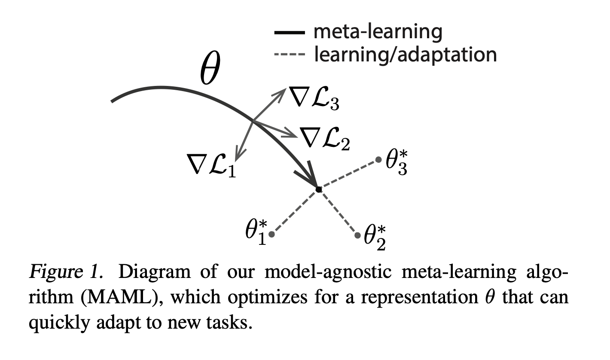
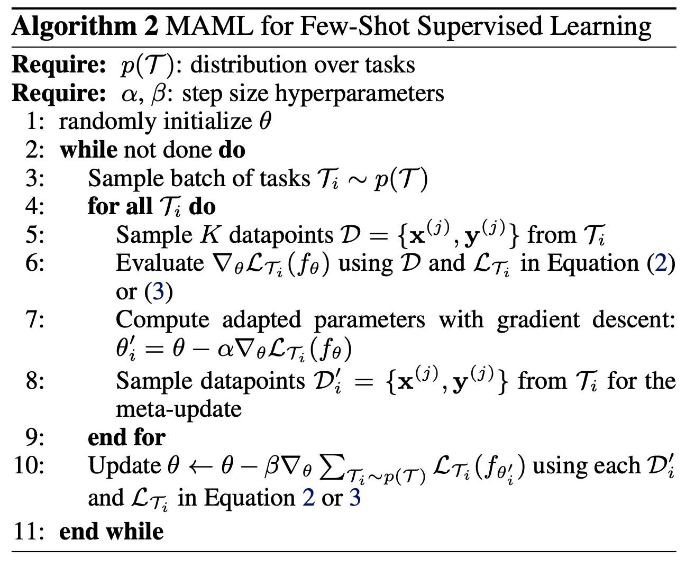

<table>
  <tr>
    <td></td>
    <td></td>
  </tr>
</table>

## Install
```bash
git clone https://github.com/mpiorczynski/maml-from-scratch.git
cd maml-from-scratch
conda create -n maml-from-scratch python=3.9
conda activate maml-from-scratch
pip install -r requirements.txt
```

Stronly inspired by `higher` package MAML [example](https://github.com/facebookresearch/higher/blob/main/examples/maml-omniglot.py).

## Usage
```
./run.sh maml.py \
  --task-name 'sinusoid' \
  --k-shot 10 --k-query 10 \
  --meta-batch-size 16 --num-epochs 10 \
  --meta-optimizer 'adam' --meta-learning-rate 1e-3 \
  --inner-steps 1 --inner-learning-rate 0.01 \
  --seed 42 \
  --use-wandb \
  --log-interval 100 \
  --run-name 'sinusoid_10-shot_steps=1'
```

```
./run.sh maml.py \
  --task-name 'omniglot' \
  --n-way 20 --k-shot 5 --k-query 5 \
  --meta-batch-size 16 --num-epochs 10 \
  --meta-optimizer 'adam' --meta-learning-rate 1e-3 \
  --inner-steps 5 --inner-learning-rate 0.1 \
  --seed 42 \
  --use-wandb \
  --log-interval 100 \
  --run-name 'omniglot_20-way_5-shot_steps=5'
```

## Citations
```bibtex
@inproceedings{finn2017model,
  title={Model-agnostic meta-learning for fast adaptation of deep networks},
  author={Finn, Chelsea and Abbeel, Pieter and Levine, Sergey},
  booktitle={International conference on machine learning},
  pages={1126--1135},
  year={2017},
  organization={PMLR}
}
```